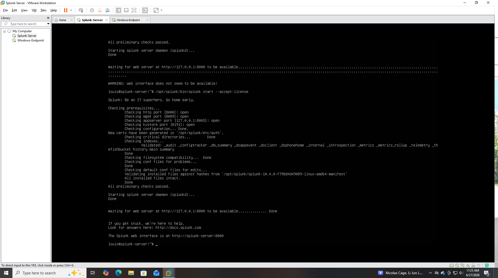
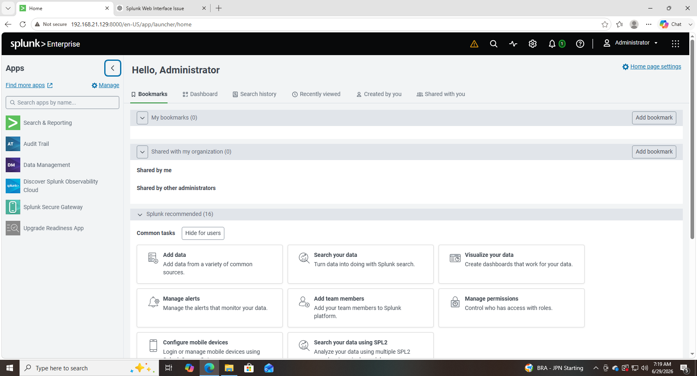
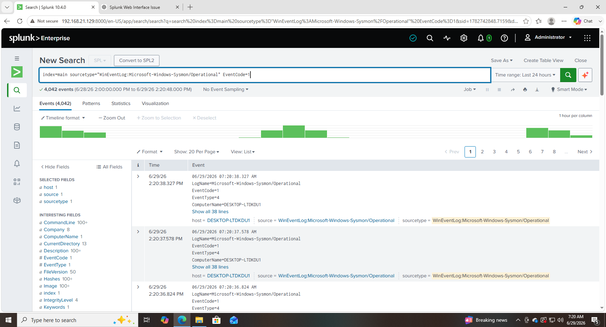
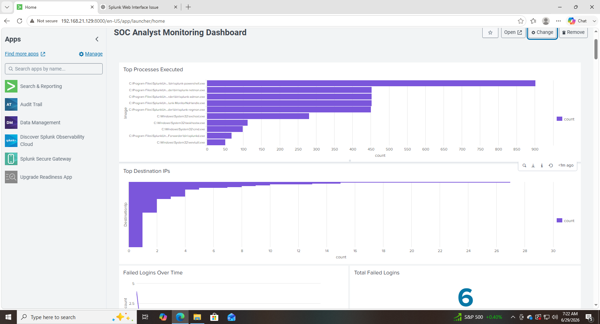
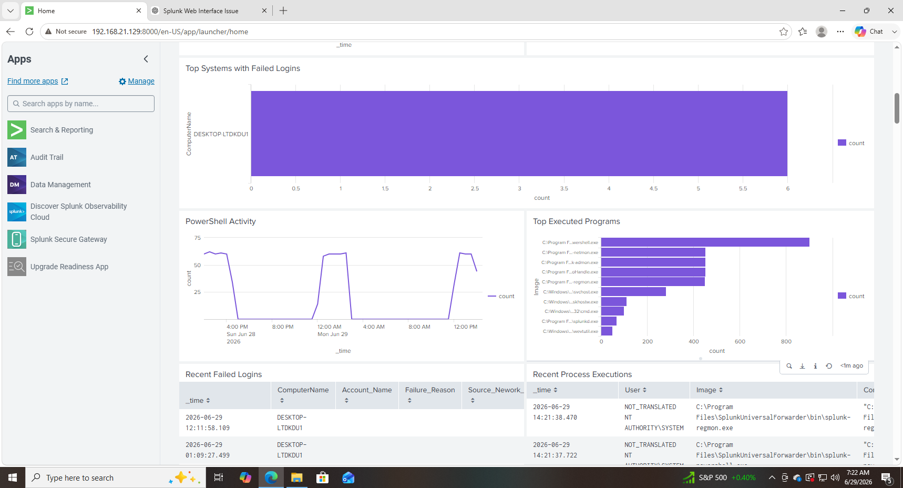
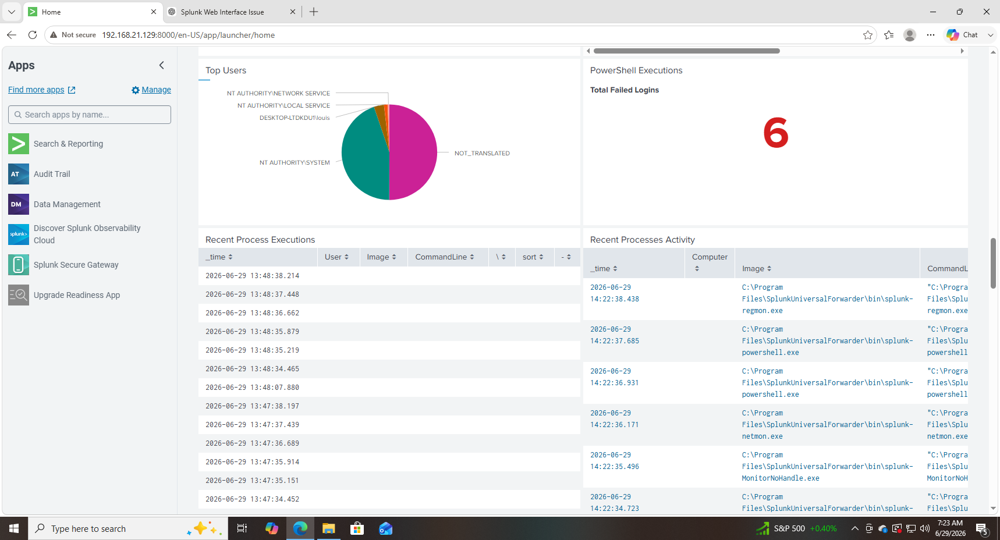

# 🛡️ Splunk SOC Lab

## Overview

This project demonstrates how I built a Security Operations Center (SOC) lab using Splunk Enterprise on Ubuntu and a Windows 10 endpoint. I configured Windows Event Log collection using the Splunk Universal Forwarder and created dashboards to monitor and analyze security events.

---

## Lab Environment

| Component | Technology |
|-----------|------------|
| SIEM | Splunk Enterprise |
| Endpoint | Windows 10 |
| Server | Ubuntu Linux |
| Virtualization | VMware Workstation |
| Log Collection | Splunk Universal Forwarder |
| Operating System Logs | Windows Event Logs |

---

## Skills Demonstrated

- Splunk Enterprise Administration
- SIEM Deployment
- Windows Event Log Collection
- Universal Forwarder Configuration
- Dashboard Creation
- SPL (Search Processing Language)
- Linux Administration
- Virtual Machine Management
- Security Monitoring
- Troubleshooting

---

## Project Screenshots

## Ubuntu Installation

Installed Ubuntu Server and configured Splunk Enterprise.

---

## Splunk Administration

Configured indexes, inputs, and data sources.

---

## Windows Event Search

Verified Windows Security Events were successfully indexed.

---

## Dashboard Overview

Created a custom SOC dashboard to monitor Windows activity.

---

## Dashboard Analytics

Visualized event trends and security metrics.

---

## Security Events

Investigated Windows Security Event Logs using SPL searches.

---

## Lessons Learned

This project helped me understand how a SIEM collects, indexes, and analyzes security logs from Windows endpoints. I gained hands-on experience installing Splunk Enterprise, configuring a Universal Forwarder, troubleshooting connectivity issues, creating dashboards, and using SPL searches to investigate Windows events.

---

## Future Improvements

- Add Sysmon log collection
- Create custom alerts
- Add additional Windows endpoints
- Integrate threat intelligence
- Build correlation searches